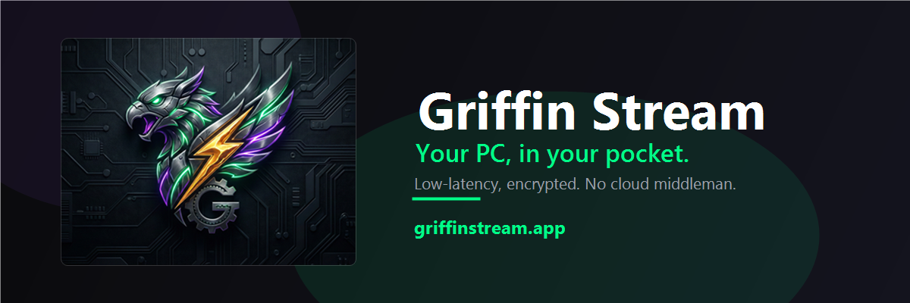

 

**Turn your phone or tablet into a fast, secure remote for your own Windows PC.**

Low-latency HEVC video · full mouse, keyboard & gamepad · encrypted, direct — no cloud middleman.

 

---

## What is Griffin Stream?

**Griffin Stream** is a remote desktop system for controlling a Windows PC you own from an Android device. The **Android app** streams your PC's screen and sends your input; the **Windows server** in this project runs on the PC you want to control.

Your session goes **straight from your device to your own PC** over an encrypted TLS connection with key-based pairing. There's no relay service, no account, and no tracking.

## ⬇️ Download

| Component | Where |
|-----------|-------|
| 📱 **Android app** | Google Play *(coming soon)* |
| 💻 **Windows server** | **[griffinstream.app/download](https://griffinstream.app/download)** |

> The download link always points to the latest release below.

## ✨ Features

- ⚡ **Low latency, high fidelity** — hardware-accelerated H.264 / H.265 (HEVC) with optional 10-bit color and adaptive bitrate.
- 🎮 **Full input** — precision touch-mouse modes, on-screen keyboard, and dual virtual joysticks with real gamepad support (via [ViGEmBus](https://github.com/nefarius/ViGEmBus/releases)).
- 🔒 **Private by design** — direct, encrypted, key-authenticated connection to your own PC. No relay, no accounts, no analytics.
- 🖥️ **Multi-monitor** — pick which display to stream, or view them all.
- ⏰ **Wake-on-LAN** — power on a sleeping PC and reconnect from saved history.
- 🧪 **Demo mode** — try the controls before you even set up your PC.

## 🚀 Quick start

1. **Install the app** on your Android device (Google Play — coming soon).
2. **Install the server** on your Windows PC: **[download here](https://griffinstream.app/download)** and run the installer.
3. **Launch the server** — on first run it generates its TLS certificate automatically and shows a pairing step.
4. **Pair once** from the app, then connect. Your PC is remembered from then on.

## 🪟 First launch on Windows

Because the app is new and not yet code-signed, Windows SmartScreen may show a
**"Windows protected your PC"** screen. This is expected while the app builds reputation:

> Click **More info → Run anyway.**

The server is safe to run on your own PC.

**Gamepad support** is optional and requires the [ViGEmBus driver](https://github.com/nefarius/ViGEmBus/releases) (a kernel driver installed separately). Mouse and keyboard work without it.

## 🔐 Security & privacy

- All remote-control traffic is encrypted with **TLS** and authenticated with a **key pair** — the private key never leaves your device.
- The connection is made **only** to the server address you provide. Nothing is routed through developer servers.
- No analytics, advertising, or tracking.

Read the full [Privacy Policy](https://griffinstream.app/privacy.html) and [Terms of Service](https://griffinstream.app/terms.html).

## 🌐 Links

- **Website:** [griffinstream.app](https://griffinstream.app)
- **Download:** [griffinstream.app/download](https://griffinstream.app/download)
- **Privacy:** [griffinstream.app/privacy.html](https://griffinstream.app/privacy.html)
- **Terms:** [griffinstream.app/terms.html](https://griffinstream.app/terms.html)

---

© 2026 Griffin Stream · Private, direct, no middleman.

